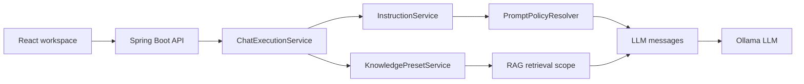

# Local Assistant Workbench

Локальная студия для работы с `ollama` как с единым assistant-workbench, а не как с набором несвязанных фич.

Продуктовая модель теперь одна:

- единый backend-контракт для чата через `POST /api/chat`
- два режима исполнения: `RAG` и `DIRECT`
- одна prompt policy для модели, system prompt, automatic scopes и выбранных инструкций
- `PostgreSQL + pgvector` для материалов, инструкций и гибридного vector RAG
- legacy JSON-хранилище осталось только для миграционного импорта и quarantine битых записей

## Что уже есть

- локальный runtime `ollama`
- веб-интерфейс на `React + Vite`
- backend на `Spring Boot`
- единый chat execution pipeline для direct и RAG сценариев
- библиотека инструкций с automatic assistant/workspace scopes и выбираемыми chat scenario инструкциями
- ingestion материалов при записи: нормализация, дедупликация, chunking, embeddings и индексирование

## Production deployment

Production baseline для сервера заказчика описан отдельно: [docs/deploy-linux-compose.md](docs/deploy-linux-compose.md).
Целевой контур — один Ubuntu 24.04 сервер, Docker Compose, frontend nginx на `127.0.0.1:8080`,
HTTPS на reverse proxy заказчика, PostgreSQL/pgvector как стабильный retrieval path и обязательный
preflight после каждого deploy/restore.

## Продуктовая модель

Приложение остается локальным assistant-workbench с двумя режимами:

- `RAG`: ответ строится только по найденному контексту из загруженных материалов через гибридный retrieval, где `semantic` path остаётся в `PostgreSQL`, а `lexical` path по умолчанию идёт через `PostgreSQL` и может быть переведён на `Elasticsearch` через rollout mode `postgres|auto|elasticsearch`
- `DIRECT`: прямой запрос к локальной модели без retrieval

Оба режима идут через один API и один LLM client.

## Runtime architecture



Инструкции и knowledge presets не являются тупиковыми библиотеками: chat execution резолвит их перед вызовом модели. Инструкции входят в runtime prompt policy, а presets задают effective knowledge scope для RAG retrieval и trace.

## Prompt Policy

Правила сборки runtime prompt фиксированы и одинаковы для всех клиентов:

1. `request.model` переопределяет модель по умолчанию из backend-конфига.
2. `request.systemPrompt` остаётся legacy alias для временной request-инструкции.
3. Runtime-инструкции собираются из assistant/workspace scopes, выбранных `instructionIds`/`scenarioInstructionIds` и `temporaryInstruction`.
4. `SYSTEM` и `SAFETY` инструкции входят в system message; `CONTEXT` и `USER` инструкции входят в user message перед запросом пользователя.
5. Для `RAG` backend всегда добавляет grounding rules: отвечать только по найденному контексту, явно признавать неполноту контекста и не галлюцинировать.

Если scenario-инструкция не выбрана, она не влияет на выполнение запроса; assistant/workspace scopes применяются автоматически по своему target.

## Быстрый старт

1. Подними `PostgreSQL 16+` с установленным `pgvector`.

Самый простой локальный вариант через Docker:

```bash
docker run --name ragstudio-postgres \
  -e POSTGRES_DB=ragstudio \
  -e POSTGRES_USER=ragstudio \
  -e POSTGRES_PASSWORD=ragstudio \
  -p 5432:5432 \
  -d pgvector/pgvector:pg16
```

Если используешь уже существующий PostgreSQL, создай базу `ragstudio`, дай backend-пользователю доступ и один раз выполни:

```sql
CREATE EXTENSION IF NOT EXISTS vector;
```

2. Подтяни локальные модели Ollama:

```bash
./scripts/pull-model.sh qwen2.5:7b
./scripts/pull-model.sh nomic-embed-text
```

Если хочешь включить `DeepSeek` на текущем `MacBook Pro M1 Pro / 16 GB`, подтяни обязательный локальный fast-path отдельно:

```bash
./scripts/pull-deepseek-local.sh
```

3. Для Codex, agent, PTY и других non-interactive запусков подними стек под supervisor-процессом:

```bash
./scripts/run-local-stack.sh
```

Это канонический direct entrypoint для Codex/agent runtime; отдельный `zsh ./scripts/run-local-stack.sh` workaround больше не нужен.

Для обычного ручного shell-сценария detached helper по-прежнему доступен:

```bash
./scripts/start-studio.sh
```

4. Открой интерфейс:

```text
http://127.0.0.1:5173
```

5. Добавь материалы, выбери инструкции при необходимости и используй либо RAG-панель, либо direct playground.

## Отдельный запуск по частям

Для Codex/agent/PTY-supported workflow используй `./scripts/run-local-stack.sh` напрямую: он не выходит после readiness и держит дочерние сервисы живыми, пока жив сам supervising process.

Нижние `start-*` команды остаются low-level helper-ами для обычного ручного shell-запуска, где detached child survival контролируется самим терминалом.

```bash
./scripts/start-ollama.sh
./scripts/pull-model.sh qwen2.5:7b
./scripts/pull-model.sh nomic-embed-text
./scripts/start-backend.sh
./scripts/start-frontend.sh
```

Для backend startup и backend tests проект теперь ожидает `Java 21`. Скрипты сначала пробуют `JAVA_21_HOME`, затем текущий `JAVA_HOME`, Homebrew `openjdk@21` и только потом системный `java_home -v 21`.

По умолчанию backend подключается к:

```text
jdbc:postgresql://127.0.0.1:5432/ragstudio
username: ragstudio
password: ragstudio
```

При необходимости можно переопределить:

```bash
export SPRING_DATASOURCE_URL=jdbc:postgresql://127.0.0.1:5432/ragstudio
export SPRING_DATASOURCE_USERNAME=ragstudio
export SPRING_DATASOURCE_PASSWORD=ragstudio
```

На старте backend делает preflight-проверку доступности PostgreSQL. Flyway-миграции создают таблицы `materials`, `material_chunks`, `tsvector`-индекс и `pgvector`-индекс автоматически.

## Рекомендованный DeepSeek rollout для этой машины

- `qwen2.5:7b` остаётся backend default и безопасной baseline-моделью.
- `deepseek-r1:8b` — обязательный локальный DeepSeek-кандидат для первого рабочего `DIRECT` и `RAG` smoke.
- `deepseek-r1:14b` — optional comparison target, если после `8b` хочется сравнить качество и latency.
- embeddings не меняются: для retrieval по-прежнему используется `nomic-embed-text`.
- для cold-start `deepseek-r1:8b` backend `Ollama` timeout поднят до `600` секунд, потому что на `M1 Pro / 16 GB` первый ответ может занимать несколько минут.

Подтянуть обязательный локальный fast-path можно так:

```bash
./scripts/pull-deepseek-local.sh
```

Для Docker Compose DeepSeek подтягивается отдельно, чтобы обычный startup не скачивал тяжёлую модель без явного выбора:

```bash
APP_LLM_EXTRA_MODELS=deepseek-r1:8b docker compose up -d ollama ollama-init backend frontend
```

Если хочешь сравнить обе модели явно:

```bash
./scripts/pull-model.sh deepseek-r1:8b
./scripts/pull-model.sh deepseek-r1:14b
```

Практическая рекомендация для текущего ноутбука:

- сначала доведи локальный acceptance до `deepseek-r1:8b`
- `deepseek-r1:14b` обычно заметно тяжелее `qwen2.5:7b` по latency, особенно на длинных `RAG`-запросах
- `deepseek-r1:14b` имеет смысл тянуть уже после успешного `8b` как optional comparison
- первый `DIRECT` или `RAG` запрос на `deepseek-r1:8b` после pull/restart может прогреваться несколько минут; это ожидаемо для этой машины
- `deepseek-r1:32b`, `deepseek-r1:671b` и `DeepSeek-V3.1` не входят в локальный v1 rollout на этой машине; это отдельный server-grade follow-up.
- текущий backend не передаёт reasoning/thinking controls и для первого этапа это нормально: `DeepSeek` подключается как обычная selectable chat-модель через существующий `Ollama`-контур.

### Optional Elasticsearch sidecar and rollout runbook

Фазы 3-5 добавляют opt-in контур `Elasticsearch` для shadow indexing и production lexical rollout. Источник истины по материалам, lineage, readiness и embeddings по-прежнему `PostgreSQL`; рекомендуемый production mode после валидации — `APP_RAG_LEXICAL_PROVIDER=auto`, чтобы lexical path шёл через `Elasticsearch`, а при деградации search plane backend автоматически откатывался на PostgreSQL fallback.

Поднять локальный sidecar можно отдельно:

```bash
./scripts/start-elasticsearch.sh
export APP_SEARCH_SYNC_ENABLED=true
export SPRING_ELASTICSEARCH_URIS=http://127.0.0.1:9200
```

Если запускаешь защищённый Elasticsearch не через локальный sidecar, можно дополнительно задать:

```bash
export SPRING_ELASTICSEARCH_USERNAME=elastic
export SPRING_ELASTICSEARCH_PASSWORD=your-password
```

После этого backend начнёт наполнять versioned index `rag-chunks-v1` через aliases `rag-chunks-read` и `rag-chunks-write`. Стандартный `./scripts/start-studio.sh` по умолчанию ничего не меняет и search sync не включает. В Codex/agent/PTY runtime поддерживаемый long-lived способ держать локальные сервисы живыми теперь только `./scripts/run-local-stack.sh`.

При включённом `APP_SEARCH_SYNC_ENABLED=true` обычный backend startup теперь:

- создаёт versioned index, если его ещё нет
- переводит `rag-chunks-write` на configured `index-version`
- создаёт `rag-chunks-read` только если alias ещё отсутствует
- не двигает существующий `rag-chunks-read` автоматически при restart или смене `index-version`

Оба operator script используют те же `SPRING_ELASTICSEARCH_URIS`, `SPRING_ELASTICSEARCH_USERNAME`, `SPRING_ELASTICSEARCH_PASSWORD` и `APP_SEARCH_SYNC_INDEX_PREFIX`, что и runtime backend.

#### Короткий operator runbook

1. Prepare index

```bash
./scripts/search-prepare-index.sh v2
```

Скрипт создаёт `rag-chunks-v2` при необходимости, переводит только `rag-chunks-write` на новый target и намеренно не делает read cutover.

2. Backfill / rebuild write index

```bash
./scripts/search-rebuild-write-index.sh
```

Этот путь нужен для полного replay текущего `write` target. Если проблема только в terminal `FAILED` search-sync events и полный wipe не нужен, используй:

```bash
./scripts/search-requeue-failed.sh
```

3. Shadow compare before cutover

Для live rollout держи lexical mode на `APP_RAG_LEXICAL_PROVIDER=postgres` и включай shadow sampling через `APP_RAG_SHADOW_ENABLED=true`. Для локального или CI proof текущий Phase 4 artifact собирается существующим integration layout:

```bash
./scripts/test-backend.sh integration -Dit.test=ElasticsearchPhase4IT
```

Отчёт сравнения пишется в `backend/target/search-quality/phase4-shadow-report.md`.

4. Promote read alias

```bash
./scripts/search-promote-read-alias.sh v2
```

После этого можно переводить runtime на `APP_RAG_LEXICAL_PROVIDER=auto`: lexical retrieval пойдёт через `Elasticsearch`, а при деградации search plane останется PostgreSQL fallback.

5. Rollback

```bash
./scripts/search-promote-read-alias.sh v1
```

Rollback здесь означает только возврат `rag-chunks-read` на предыдущую уже подготовленную версию. Он не очищает текущий `write` index и не двигает `rag-chunks-write`, пока оператор не сделает это отдельно.

### Quality-layer rollout

Phase 7 добавляет отдельный rollout layer поверх существующего search lifecycle. Он не меняет `ACTIVE/SUPERSEDED`, не делает schema rollback и не вмешивается в текущий Elasticsearch alias/fallback flow. Все переключатели только config/env driven:

- `APP_ROLLOUT_METADATA_V1`
- `APP_ROLLOUT_STRUCTURED_V1`
- `APP_ROLLOUT_METADATA_FILTERS_V1`
- `APP_ROLLOUT_SEARCH_API_V1`
- `APP_ROLLOUT_RERANKER_V1`
- `APP_ROLLOUT_QUERY_HINTS_V1`

Каждый флаг по умолчанию `false`.

#### Flag semantics

- `metadata-v1`: включает metadata-first enrichment/coverage layer. Откат не удаляет уже сохранённые metadata.
- `structured-v1`: включает `structured-v1` как default profile для новых ingest и открывает ACTIVE rechunk/backfill endpoints.
- `metadata-filters-v1`: включает pre-ranking metadata filters в chat/search. При `false` входящие `retrievalFilters` принимаются, но suppress'ятся.
- `search-api-v1`: единственный hard gate для `POST /api/search`. При `false` endpoint отвечает `409 search.api_disabled`.
- `reranker-v1`: включает deterministic reranker. При `false` runtime принудительно использует `hybrid-v1` даже если raw config указывает `hybrid-rerank-v1`.
- `query-hints-v1`: включает deterministic hint extraction и auto-apply. При `false` manual filters всё ещё работают, если включён `metadata-filters-v1`.

#### Recommended enablement order

1. Включить `APP_ROLLOUT_METADATA_V1=true`.
2. Включить `APP_ROLLOUT_STRUCTURED_V1=true` только для новых ingest.
3. Прогнать ACTIVE backfill через существующий batch API, начиная с dry-run.
4. Включить `APP_ROLLOUT_METADATA_FILTERS_V1=true`.
5. Включить `APP_ROLLOUT_SEARCH_API_V1=true`.
6. Включить `APP_ROLLOUT_RERANKER_V1=true`.
7. Включить `APP_ROLLOUT_QUERY_HINTS_V1=true`.

#### Health fields to watch

`GET /api/health` теперь возвращает nested `qualityLayer` block:

- `qualityLayer.flags`
- `qualityLayer.metadataCoverage`
- `qualityLayer.activeBackfillCoverage`
- `qualityLayer.retrievalWindow`

`retrievalWindow` intentionally ephemeral: это in-memory окно последних retrieval sample'ов, и оно сбрасывается после restart backend.

#### ACTIVE backfill runbook

Существующий path не меняется: используй только текущий ACTIVE rechunk API.

1. Dry-run first:

```bash
curl -sS -X POST http://127.0.0.1:8080/api/materials/rechunk-active/batch \
  -H 'Content-Type: application/json' \
  -d '{"limit":100,"dryRun":true}'
```

2. Проверяй:

- `scheduled`
- `alreadyCurrent`
- `legacyBestEffort`
- `nextCursor`
- `qualityLayer.activeBackfillCoverage`

3. Продолжай тем же batch endpoint без `dryRun`, двигаясь по `nextCursor`.

4. Остановить и возобновить можно безопасно: paging stable по `createdAt/id`, `SUPERSEDED` не затрагиваются, уже переведённые ACTIVE записи остаются idempotent.

#### Rollback order

1. `APP_ROLLOUT_QUERY_HINTS_V1=false`
2. `APP_ROLLOUT_RERANKER_V1=false`
3. `APP_ROLLOUT_SEARCH_API_V1=false`
4. `APP_ROLLOUT_METADATA_FILTERS_V1=false`
5. `APP_ROLLOUT_STRUCTURED_V1=false`
6. `APP_ROLLOUT_METADATA_V1=false`

Rollback здесь purely behavioral:

- выключение флагов не удаляет уже сохранённые metadata, structured chunks или search documents;
- Elasticsearch alias rollback остаётся прежним operator flow через `search-promote-read-alias.sh` и не считается частью quality-layer rollback.

## Остановка

```bash
./scripts/stop-studio.sh
./scripts/stop-ollama.sh
```

## Полезные команды

```bash
./scripts/run-local-stack.sh
./scripts/chat.sh
./scripts/chat.sh qwen2.5:7b
./scripts/test-model.sh
./scripts/pull-deepseek-local.sh
./scripts/start-elasticsearch.sh         # optional Elasticsearch sidecar for shadow indexing
./scripts/search-prepare-index.sh v2     # create/index target version + move write alias safely
./scripts/search-promote-read-alias.sh v2 # explicit read cutover after validation
./scripts/search-requeue-failed.sh       # recover FAILED search-sync events without manual SQL
./scripts/search-rebuild-write-index.sh  # wipe current write index and replay all searchable ACTIVE materials
./scripts/test-backend.sh              # fast-suite: mvn test
./scripts/test-backend.sh fast -Dtest=MaterialControllerMetadataFlowTest,MaterialControllerContractTest,MaterialServiceTest
./scripts/test-backend.sh critical-materials  # minimal Docker-backed material proof
./scripts/test-backend.sh integration  # full proof: mvn verify (working Docker/Testcontainers required)
./scripts/test-backend.sh integration -Dit.test=MaterialControllerIT
curl http://127.0.0.1:11434/api/tags
curl http://127.0.0.1:8080/api/health
curl http://127.0.0.1:8080/api/models
curl http://127.0.0.1:8080/api/materials
curl http://127.0.0.1:8080/api/materials/policy
curl http://127.0.0.1:8080/api/instructions
```

## Проверка backend

- `./scripts/test-backend.sh` запускает быстрый локальный `mvn test`: только `*Test`, без Docker-backed integration suite.
- Для metadata ingestion локальный fast-proof проходит через `./scripts/test-backend.sh fast -Dtest=MaterialControllerMetadataFlowTest,MaterialControllerContractTest,MaterialServiceTest`.
- `./scripts/test-backend.sh critical-materials` запускает минимальный Docker-backed proof для material-domain: `PostgresMaterialRepositoryIT`, `MaterialLineageVersionMigrationIT`, `MaterialSearchSyncLifecycleIT`, `MaterialRuntimeTopologyIT`.
- `./scripts/test-backend.sh integration` запускает полный backend proof через `mvn verify`: выполняет весь `*IT` набор и проверяет живой `PostgreSQL + pgvector + Elasticsearch` контур там, где integration suite это ожидает.
- Targeted Docker-backed proof запускается только через `./scripts/test-backend.sh integration -Dit.test=MaterialControllerIT` или другой `-Dit.test=...` селектор для нужного integration class.
- `./scripts/test-backend.sh fast -Dtest=...IT` и `./scripts/test-backend.sh test -Dtest=...IT` теперь завершаются ранним preflight failure с подсказкой перейти на `integration`, чтобы fast-suite не маскировал Testcontainers blocker под обычный локальный test run.
- `fast` не доказывает storage semantics: FK, `ON DELETE CASCADE`, SQL ordering, locking и transactional behavior считаются доказанными только через PostgreSQL-backed integration tests.
- `InMemoryMaterialRepository` допустим для pure service/domain behavior, но не считается авторитетным proof для constraint/cascade/order semantics.
- Для локального `critical-materials` и `integration` proof недостаточно просто видеть команду `docker` в `PATH`: текущий shell/runtime должен реально давать `Testcontainers` доступ к Docker daemon/socket. Если Docker недоступен, скрипт завершится ранним preflight failure вместо длинного Maven-прогона.
- В текущем Codex Desktop runtime с Colima/non-default Docker socket `critical-materials` и `integration` намеренно завершаются ранним preflight failure: это честнее, чем уходить в длинный `mvn verify`, который все равно упадет внутри `Testcontainers` на Docker API negotiation.

## Основной Chat API

```bash
POST http://127.0.0.1:8080/api/chat
Content-Type: application/json
```

Тело запроса:

```json
{
  "mode": "RAG",
  "model": "qwen2.5:7b",
  "prompt": "Какие условия у тарифа Премиум?",
  "systemPrompt": "Отвечай кратко и по делу.",
  "instructionIds": [
    "3f4bdf02-02f9-4721-b658-e75f62333121"
  ]
}
```

Пример ответа:

```json
{
  "mode": "RAG",
  "model": "qwen2.5:7b",
  "prompt": "Какие условия у тарифа Премиум?",
  "answer": "Тариф Премиум стоит 12000 тенге в месяц и включает приоритетную поддержку.",
  "createdAt": "2026-04-16T09:15:00Z",
  "promptTokens": 182,
  "completionTokens": 31,
  "totalTokens": 213,
  "appliedInstructions": [
    {
      "id": "3f4bdf02-02f9-4721-b658-e75f62333121",
      "title": "Базовая роль ассистента",
      "category": "system"
    }
  ],
  "sources": [
    {
      "materialId": "c6dd6caa-ed4c-4135-8f03-e67d3fbdc4de",
      "title": "Pricing note",
      "excerpt": "Тариф Премиум стоит 12000 тенге в месяц и включает приоритетную поддержку.",
      "score": 97,
      "page": 1,
      "extractor": "pdfbox",
      "ocrUsed": false
    }
  ]
}
```

### Пример `RAG`

```bash
curl http://127.0.0.1:8080/api/chat \
  -H "Content-Type: application/json" \
  -d '{
    "mode": "RAG",
    "model": "qwen2.5:7b",
    "prompt": "Какие условия у тарифа Премиум?"
  }'
```

Если релевантный контекст не найден, backend вернет понятный ответ и пустой `sources`.

### Пример `DIRECT`

```bash
curl http://127.0.0.1:8080/api/chat \
  -H "Content-Type: application/json" \
  -d '{
    "mode": "DIRECT",
    "model": "qwen2.5:7b",
    "systemPrompt": "Отвечай понятно и кратко",
    "prompt": "Объясни, как работает request-response для локальной LLM"
  }'
```

Для `DIRECT` режимa `sources` будет пустым, а выбранные инструкции вернутся в `appliedInstructions`.

### Пример `DIRECT` через DeepSeek

`DeepSeek` выбирается тем же полем `model`, потому что это обычная chat-модель внутри подключенной Ollama:

```bash
curl http://127.0.0.1:8080/api/chat \
  -H "Content-Type: application/json" \
  -d '{
    "mode": "DIRECT",
    "model": "deepseek-r1:8b",
    "prompt": "Коротко объясни, какой контур LLM сейчас используется"
  }'
```

Очередной async-контур использует тот же contract:

```bash
curl http://127.0.0.1:8080/api/chat-runs \
  -H "Content-Type: application/json" \
  -d '{
    "mode": "DIRECT",
    "model": "deepseek-r1:8b",
    "prompt": "Ответь одним абзацем"
  }'
```

## API моделей

```bash
GET /api/models
```

Backend проксирует список реально установленных chat-моделей из подключенной `ollama`. UI не держит hardcoded список моделей: если `deepseek-r1:8b` не виден в `GET /api/models`, значит backend смотрит не на тот Ollama endpoint или модель не установлена в этой Ollama-инстанции. `nomic-embed-text` остаётся embeddings-моделью для retrieval и не должен выбираться как chat-модель.

## Как теперь работает RAG

1. Backend извлекает текст из upload или прямого текстового ввода.
2. Контент нормализуется, дедуплицируется по `content_hash` и режется на чанки.
3. Для каждого чанка backend синхронно получает embedding через локальный `ollama` endpoint `/api/embed` на модели `nomic-embed-text`.
4. Материал, чанки, `tsvector` и embeddings сохраняются в `PostgreSQL`.
5. Для запроса пользователя строится embedding, затем backend берёт:
   - semantic top-N через `pgvector`
   - lexical top-N через PostgreSQL full-text search по умолчанию или через `Elasticsearch` read alias при включённом rollout mode
6. Оба списка объединяются через `Reciprocal Rank Fusion`, после чего top-4 чанка попадают в prompt.

`sources[].score` теперь означает нормализованный hybrid relevance score в диапазоне `0..100`.

## API материалов

```bash
GET    /api/materials
GET    /api/materials/policy
GET    /api/materials/{id}/lineage
POST   /api/materials
POST   /api/materials/upload
POST   /api/materials/{id}/reindex
DELETE /api/materials/{id}
```

`GET /api/materials` возвращает операторский каталог с runtime-полями `updatedAt`, `indexingAttempts` и `nextRetryAt`, чтобы UI мог показывать свежесть версии, число попыток индексации и ближайший retry без отдельного polling-контракта.

### Операторские действия по материалам

`POST /api/materials/{id}/reindex` предназначен только для `ACTIVE`-версий в статусе `FAILED` или `PARTIAL_READY`.

- backend переводит материал обратно в `PENDING`
- очищает claim/retry scheduling и сразу будит drain очереди
- повторно использует уже сохранённый нормализованный контент и chunk-модель
- не перезапускает OCR, parse исходного файла или повторный upload

Используй `reindex`, когда проблема была в embedding/indexing lifecycle или материал остался в `PARTIAL_READY` из-за warning. Если изменился сам исходный документ или нужно заново извлечь сырой контент, нужен новый upload, а не `reindex`.

`GET /api/materials/{id}/lineage` возвращает всю историю выбранного материала с уже подготовленной metadata для UI:

```json
{
  "requestedMaterialId": "c6dd6caa-ed4c-4135-8f03-e67d3fbdc4de",
  "activeMaterialId": "c6dd6caa-ed4c-4135-8f03-e67d3fbdc4de",
  "versions": [
    {
      "id": "c6dd6caa-ed4c-4135-8f03-e67d3fbdc4de",
      "title": "Pricing note",
      "status": "PARTIAL_READY",
      "versionState": "ACTIVE",
      "createdAt": "2026-04-16T09:15:00Z",
      "updatedAt": "2026-04-16T09:17:00Z",
      "indexingAttempts": 2,
      "nextRetryAt": null,
      "supersededByMaterialId": null,
      "supersedeReason": null
    }
  ]
}
```

Для historical-версий lineage также возвращает `supersedeReason`; если запись пришла из legacy-истории без этой metadata, backend подставляет явный fallback reason вместо пустого значения.

### Политика upload

`GET /api/materials/policy` возвращает актуальный backend-контракт для загрузки:

```json
{
  "maxUploadBytes": 8388608,
  "acceptedExtensions": [
    "txt",
    "md",
    "markdown",
    "csv",
    "json",
    "xml",
    "yaml",
    "yml",
    "log",
    "sql",
    "java",
    "kt",
    "js",
    "ts",
    "tsx",
    "jsx",
    "py",
    "properties",
    "html",
    "htm",
    "doc",
    "docx",
    "rtf",
    "odt",
    "pdf"
  ],
  "acceptedMimeHints": [
    "text/plain",
    "text/markdown",
    "text/csv",
    "application/json",
    "application/xml",
    "text/xml",
    "application/x-yaml",
    "text/yaml",
    "text/html",
    "application/msword",
    "application/vnd.openxmlformats-officedocument.wordprocessingml.document",
    "application/rtf",
    "text/rtf",
    "application/vnd.oasis.opendocument.text",
    "application/pdf"
  ],
  "richDocumentSupport": true,
  "pdf": {
    "enabled": true,
    "scannedPdfSupport": true,
    "mode": "embedded_text_and_ocr",
    "ocrLanguages": ["kaz", "rus", "eng"],
    "ocrMaxPages": 12
  }
}
```

Если runtime self-check видит, что `tesseract` или нужные language packs недоступны, `pdf.enabled` остаётся `true`, но policy переключается в partial mode:

```json
{
  "pdf": {
    "enabled": true,
    "scannedPdfSupport": false,
    "mode": "embedded_text_only",
    "ocrReasonCode": "material.ocr_unavailable",
    "ocrReasonMessage": "Tesseract OCR binary is unavailable at 'tesseract'.",
    "ocrLanguages": ["kaz", "rus", "eng"],
    "ocrMaxPages": 12
  }
}
```

Frontend использует этот endpoint для preflight-проверок до отправки multipart-запроса и для helper/warning текста в upload-форме. UI поддерживает выбор нескольких файлов, но backend-контракт upload остаётся single-file: каждый файл отправляется отдельным `POST /api/materials/upload`.

### Health readiness

`GET /api/health` теперь отражает не только факт запуска Spring Boot, но и отдельно:
- runtime health backend и core-зависимостей;
- readiness model catalog/provider;
- readiness direct chat path;
- пользовательскую готовность RAG;
- состояние knowledge base;
- OCR readiness, storage health и snapshot indexing/search-sync очередей.

```json
{
  "application": "spring-backend",
  "status": "UP",
  "timestamp": "2026-04-18T19:20:00Z",
  "directStatus": "DOWN",
  "directReasonCode": "llm.provider_unavailable",
  "directReasonMessage": "Unable to reach the local LLM provider",
  "directLastSuccessfulProbeAt": "2026-04-18T19:19:52Z",
  "ragStatus": "DOWN",
  "knowledgeStatus": "INDEXING",
  "knowledgeReasonCode": "knowledge.indexing_in_progress",
  "knowledgeReasonMessage": "Активная версия уже принята, но индекс ещё не догнал её до READY или PARTIAL_READY.",
  "materialCount": 3,
  "activeMaterialCount": 1,
  "historicalMaterialCount": 2,
  "readyMaterialCount": 0,
  "llmStatus": "UP",
  "embeddingStatus": "UP",
  "runtimeCachedAt": "2026-04-18T19:19:55Z",
  "ocrStatus": "DOWN",
  "ocrReasonCode": "material.ocr_unavailable",
  "ocrReasonMessage": "Tesseract OCR binary is unavailable at 'tesseract'.",
  "ocrLanguages": ["kaz", "rus", "eng"],
  "databaseStatus": "UP",
  "vectorStatus": "UP",
  "llmLastSuccessfulProbeAt": "2026-04-18T19:19:54Z",
  "embeddingLastSuccessfulProbeAt": "2026-04-18T19:19:53Z",
  "ragDegradedReasonCode": "llm.provider_unavailable",
  "ragDegradedReasonMessage": "Unable to reach the local LLM provider",
  "indexingPendingCount": 1,
  "indexingInProgressCount": 0,
  "indexingFailedCount": 2,
  "indexingNextRetryAt": "2026-04-18T19:21:00Z"
}
```

- `status=UP` означает, что core backend/runtime healthy: direct runtime, embeddings, PostgreSQL и `pgvector` доступны
- `status=DEGRADED` означает, что direct runtime или один из core RAG storage/runtime слоёв сейчас недоступен
- `directStatus` показывает реальную готовность direct chat path через live `chat(...)` probe
- `directReasonCode` и `directReasonMessage` объясняют, почему именно direct path сейчас недоступен
- `llmStatus` и `llmReason*` описывают readiness model catalog/provider через `listModels()`
- `ragStatus=UP` только когда direct path healthy, embeddings/storage healthy и `knowledgeStatus=READY`
- `knowledgeStatus` описывает состояние корпуса: `EMPTY`, `HISTORICAL_ONLY`, `INDEXING`, `READY` или `DEGRADED`
- `knowledgeReasonCode` и `knowledgeReasonMessage` позволяют UI и оператору не гадать, почему RAG сейчас заблокирован
- `materialCount`, `activeMaterialCount`, `historicalMaterialCount` и `readyMaterialCount` отражают backend truth-model knowledge base
- `ocrStatus` и OCR reason-поля показываются отдельно и помогают понять, сможет ли runtime обрабатывать scanned PDF, даже если direct/RAG по текстовым материалам ещё живы
- `directLastSuccessfulProbeAt`, `llmLastSuccessfulProbeAt` и `embeddingLastSuccessfulProbeAt` показывают время последней успешной проверки direct path, model catalog и embedding runtime
- `ragDegradedReasonCode` и `ragDegradedReasonMessage` объясняют, почему именно RAG сейчас degraded
- `indexingPendingCount`, `indexingInProgressCount`, `indexingFailedCount` и `indexingNextRetryAt` показывают оператору текущее состояние очереди индексации
- `databaseStatus` показывает доступность PostgreSQL
- `vectorStatus` показывает, установлен ли `pgvector` и доступен ли vector search
- knowledge state `EMPTY`, `HISTORICAL_ONLY` и `INDEXING` не переводят общий backend в `DEGRADED`: down показывается через `ragStatus` и `knowledge*` поля
- frontend использует эти поля как единственную truth-model для submit gating: `RAG` блокируется при `ragStatus != UP`, `Direct` блокируется при `directStatus != UP`
- `./scripts/start-backend.sh` сначала проверяет доступность PostgreSQL, а потом считает backend готовым только при `status=UP`
- `./scripts/run-local-stack.sh` предназначен для Codex/agent/PTY workflow: он держит Ollama, backend и frontend под одним supervising process и корректно останавливает только свои managed child-процессы

Текстовый материал:

```json
{
  "title": "Pricing note",
  "content": "Тариф Премиум стоит 12000 тенге в месяц."
}
```

### Поддерживаемые форматы upload

- `.txt`
- `.md`
- `.markdown`
- `.csv`
- `.json`
- `.xml`
- `.yaml`
- `.yml`
- `.log`
- `.sql`
- `.java`
- `.kt`
- `.js`
- `.ts`
- `.tsx`
- `.jsx`
- `.py`
- `.properties`
- `.html`
- `.htm`
- `.docx`
- `.doc`
- `.rtf`
- `.odt`
- `.pdf`

Форматы `.doc/.docx/.rtf/.odt/.html` извлекаются кроссплатформенно через JVM-native extractor. Для `.pdf` backend всегда пытается прочитать embedded text через PDFBox. Если OCR readiness подтверждён, scanned PDF тоже поддерживается через `tesseract`; если нет, policy остаётся с `.pdf`, но переключается в режим `embedded_text_only`.

### OCR и серверные зависимости

Для серверного OCR нужны:

- бинарник `tesseract`
- языковые пакеты `kaz`, `rus`, `eng`

Пример для Debian/Ubuntu:

```bash
sudo apt-get install -y tesseract-ocr tesseract-ocr-kaz tesseract-ocr-rus tesseract-ocr-eng
```

Backend кэширует OCR readiness на короткий TTL и проверяет:

- `app.ocr.enabled`
- доступность `binary-path`
- наличие всех языков из `app.ocr.languages` через `tesseract --list-langs`

На старте backend дополнительно пишет в лог результат OCR readiness check. Если PDF требует OCR, а `tesseract` или нужные language packs недоступны, policy заранее сообщает partial support, а реальный upload завершится типизированной ошибкой backend ещё до page rasterization.

## API инструкций

Инструкции не участвуют в retrieval сами по себе. Они становятся частью runtime только через `instructionIds` в chat-запросе.

```bash
GET    /api/instructions
POST   /api/instructions
PUT    /api/instructions/{id}
DELETE /api/instructions/{id}
```

`PUT /api/instructions/{id}` использует тот же payload, что и создание, сохраняет стабильный `id` и `createdAt`, но обновляет `updatedAt`. Это позволяет редактировать instruction library без потери текущего выбора инструкции в `DIRECT` и `RAG` вкладках.

Пример:

```json
{
  "title": "Базовая роль ассистента",
  "category": "system",
  "content": "Отвечай кратко, структурно и на русском языке."
}
```

## Guardrails и устойчивость

- загрузка файлов ограничена multipart-лимитами backend
- извлечение текста из upload-файлов выполняется с timeout
- дедупликация и chunking выполняются при записи, а не на каждом chat-запросе
- embeddings для чанков строятся при записи, а retrieval идёт как гибридный `semantic + lexical`
- RAG prompt строится из полного найденного chunk, а наружу в `sources[].excerpt` уходит только короткий preview
- legacy JSON-материалы и legacy JSON-инструкции можно импортировать в PostgreSQL идемпотентно, а file-based слой остаётся только migration tooling и quarantine
- ошибки backend возвращаются в едином формате:

```json
{
  "code": "provider_unavailable",
  "message": "LLM provider is unavailable",
  "timestamp": "2026-04-16T09:20:00Z",
  "requestId": "6c0d031d-6048-4c3f-b6e0-d10d69fb0d08"
}
```

`requestId` возвращается для неожиданных `500`-ошибок и помогает быстро сопоставить UI-инцидент с backend-логами. Ошибки upload теперь нормализованы:

- `413 material.upload_too_large` для файлов выше лимита
- `400 material.invalid_multipart` для битого multipart
- `400 material.missing_file_part` если часть `file` отсутствует
- `400 material.unsupported_format` для неподдерживаемого расширения
- `400 material.extraction_failed` если rich-document не удалось распарсить
- `400 material.ocr_disabled` если PDF требует OCR, но OCR выключен
- `400 material.ocr_unavailable` если бинарник `tesseract` недоступен
- `400 material.ocr_language_data_missing` если не хватает traineddata для `kaz/rus/eng`
- `400 material.ocr_timeout` если OCR не уложился в лимит
- `400 material.ocr_page_limit_exceeded` если PDF слишком большой для OCR по текущему лимиту
- `400 material.ocr_render_budget_exceeded` если страница PDF слишком велика для безопасного rasterization перед OCR

## Низкоуровневый OpenAI-совместимый вызов напрямую в Ollama

Приложение использует свой unified API, но при необходимости можно обращаться напрямую к raw OpenAI-compatible endpoint самого `ollama`:

```bash
curl http://127.0.0.1:11434/v1/chat/completions \
  -H "Content-Type: application/json" \
  -d '{
    "model": "qwen2.5:7b",
    "messages": [
      { "role": "system", "content": "Отвечай кратко и по-русски." },
      { "role": "user", "content": "Привет, кто ты?" }
    ]
  }'
```

## Где что лежит

- frontend: `frontend/`
- backend: `backend/`
- PostgreSQL `ragstudio` по умолчанию хранит материалы, инструкции, чанки, embeddings и индексы retrieval
- локальное хранилище backend: `backend/storage/`
- legacy JSON-материалы для одноразового импорта: `backend/storage/materials/`
- legacy JSON-инструкции для одноразового импорта: `backend/storage/instructions/`
- quarantine для поврежденных file-based записей: `backend/storage/quarantine/`
- модели Ollama: `~/.ollama/models`

## Если модель тяжеловата

По умолчанию разумный старт: `qwen2.5:7b`.

Для `DeepSeek` на этой машине разумный порядок такой:

- сначала `deepseek-r1:8b`
- затем, при желании, `deepseek-r1:14b` как optional comparison

Если нужен более легкий режим:

```bash
./scripts/pull-model.sh qwen2.5:3b
```

## Если DeepSeek скачан, но не виден в UI

| Симптом | Проверка | Что сделать |
| --- | --- | --- |
| `deepseek-r1:8b` есть в `~/.ollama`, но `/api/models` возвращает `llm.provider_unavailable` | `curl http://127.0.0.1:11434/api/tags` | Запусти host Ollama через `./scripts/run-local-stack.sh` или проверь `APP_LLM_BASE_URL`. |
| Docker UI показывает только `qwen2.5:7b` | `docker exec ragstudio-ollama-1 ollama list` | `docker exec ragstudio-ollama-1 ollama pull deepseek-r1:8b` или перезапусти Compose с `APP_LLM_EXTRA_MODELS=deepseek-r1:8b`. |
| `/api/models` не содержит DeepSeek, хотя Ollama работает | `curl http://127.0.0.1:8080/api/models` после login | Подтяни модель в ту же Ollama-инстанцию, на которую смотрит backend. UI отображает только backend catalog, не локальные manifest-файлы напрямую. |
| RAG заблокирован даже при видимой модели | `curl http://127.0.0.1:8080/api/health` после login | Проверь `embeddingStatus`: для RAG нужен `nomic-embed-text`, а не только chat-модель DeepSeek. |
