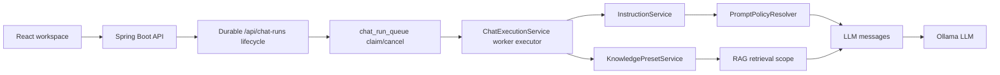

# Architecture

KEGOC RAG остается локальным assistant-workbench с двумя режимами:

- `RAG`: ответ строится по найденному контексту из загруженных материалов.
- `DIRECT`: прямой запрос к локальной chat-модели без retrieval.

Оба режима идут через durable `POST /api/chat-runs` lifecycle и один LLM client. PostgreSQL с `pgvector` остается source of truth для материалов, chunks, embeddings, lineage, chat run queue/result storage и readiness. Elasticsearch, если включен, обслуживает только lexical search plane.

## Security Boundary

KEGOC RAG is an internal single-admin workbench, not a multi-user or tenant-isolated service. All business APIs under `/api/**` require `ROLE_ADMIN`; only `GET /api/liveness` and `/api/auth/**` are public. The decision is recorded in [ADR 0010](adr/0010-single-admin-security-boundary.md).

`workspaceKey`, `projectKey`, RAG projects, reference workspaces, knowledge presets, and instruction scopes are product filters used for organization, retrieval, and prompt selection. They are not authorization boundaries and must not be treated as private user workspaces or tenant isolation.

## Runtime Flow



Инструкции и knowledge presets резолвятся перед вызовом модели. Инструкции входят в runtime prompt policy, а presets задают effective knowledge scope для RAG retrieval и trace.

## Prompt Policy

1. `request.model` переопределяет модель по умолчанию из backend-конфига.
2. `request.systemPrompt` остается legacy alias для временной request-инструкции.
3. Runtime-инструкции собираются из assistant/workspace scopes, выбранных `instructionIds`/`scenarioInstructionIds` и `temporaryInstruction`.
4. `SYSTEM` и `SAFETY` инструкции входят в system message.
5. `CONTEXT` и `USER` инструкции входят в user message перед запросом пользователя.
6. Для `RAG` backend всегда добавляет grounding rules: отвечать только по найденному контексту, явно признавать неполноту контекста и не галлюцинировать.

Если scenario-инструкция не выбрана, она не влияет на выполнение запроса; assistant/workspace scopes применяются автоматически по своему target.

## RAG Flow

1. Backend извлекает текст из upload или прямого текстового ввода.
2. Контент нормализуется, дедуплицируется по `content_hash` и режется на chunks.
3. Для каждого chunk backend получает embedding через локальный Ollama endpoint на модели `nomic-embed-text`.
4. Материал, chunks, `tsvector` и embeddings сохраняются в PostgreSQL.
5. Для пользовательского запроса строится embedding.
6. Retrieval берет semantic top-N через `pgvector` и lexical top-N через PostgreSQL full-text search или Elasticsearch read alias.
7. Результаты объединяются через Reciprocal Rank Fusion, затем top chunks попадают в prompt.

`sources[].score` означает нормализованный hybrid relevance score в диапазоне `0..100`.

## Material Metadata

Контракт metadata между backend, frontend и storage описан отдельно: [metadata-contract.md](metadata-contract.md). Обычные UI flows отправляют только canonical editable fields; backend сохраняет compatibility/display fields при edit, version upload и reindex.

## Domain And DTO Boundary

`com.example.demo.model` is the public/shared wire contract package: controller DTOs, response read models, and shared enum/value types that appear in API JSON. It must not import `service`, `api`, `controller`, `config`, or `infrastructure` packages.

`com.example.demo.service.*` owns use-case logic, ports, stored records, and internal domain flow. Internal material records such as `DocumentBlock`, `StoredMaterialChunk`, and `MaterialChunkSearchMatch` stay in service packages; public shared values such as `DocumentBlockType` and `DocumentBlockConfidence` live in `model`.

Controller-exposed DTOs are registered in `ApiContractRegistry`. The generated backend artifact at `backend/src/main/resources/api-contract/frontend-api-contract.json` is the source for frontend generated contract types.

## API Shape

Ошибки backend возвращаются в совместимом формате:

```json
{
  "code": "provider_unavailable",
  "message": "LLM provider is unavailable",
  "timestamp": "2026-04-16T09:20:00Z",
  "requestId": "6c0d031d-6048-4c3f-b6e0-d10d69fb0d08"
}
```

`requestId` возвращается для неожиданных `500`-ошибок и помогает сопоставить UI-инцидент с backend-логами.

## Chat Execution API

Canonical production flow:

```bash
POST /api/chat-runs
GET  /api/chat-runs/{id}/status
GET  /api/chat-runs/{id}/trace
GET  /api/chat-runs/{id}/result
POST /api/chat-runs/{id}/cancel
```

`POST /api/chat-runs` returns `202 Accepted` with status, trace, and result URLs. The worker claims the durable queue row, records trace lifecycle, persists the immutable result, and removes the queue entry only after terminal completion/cancellation/failure handling.

`POST /api/chat` is compatibility-only for old clients. It accepts the legacy `ChatExecutionRequest`, submits the same durable run, waits up to `app.chat-execution.compatibility-wait-timeout-seconds` (default `30`, max `120`), and returns the legacy `ChatExecutionResponse` only if the run completes quickly. If the run is still processing, it returns `408` with code `chat.run_still_processing` and a message containing the durable status/result URLs. The timeout does not cancel the run. `/api/chat` responses include `Deprecation: true` and `Link: </api/chat-runs>; rel="successor-version"`.

Remove `/api/chat` only in a future release after client usage confirms no remaining legacy callers.

## Main Endpoints

```bash
GET    /api/models
GET    /api/health
POST   /api/chat
POST   /api/chat-runs
GET    /api/chat-runs/{id}/status
GET    /api/chat-runs/{id}/trace
GET    /api/chat-runs/{id}/result
POST   /api/chat-runs/{id}/cancel
GET    /api/materials
GET    /api/materials/policy
GET    /api/materials/{id}/lineage
POST   /api/materials
POST   /api/materials/upload
POST   /api/materials/{id}/reindex
DELETE /api/materials/{id}
GET    /api/instructions
POST   /api/instructions
PUT    /api/instructions/{id}
DELETE /api/instructions/{id}
```
